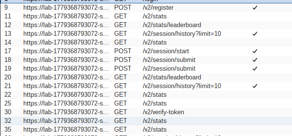
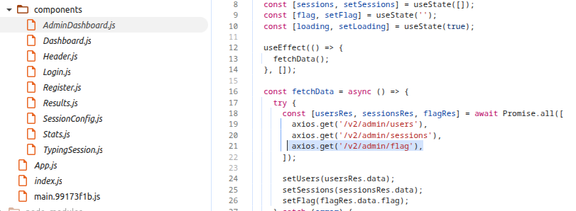
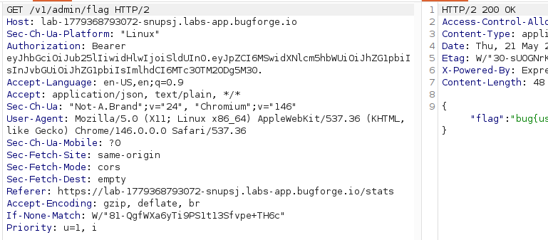
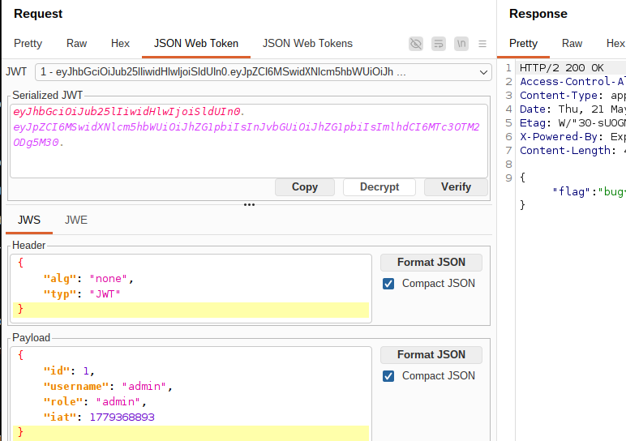

# Sokudo - Hidden Endpoint

## API Versioning
After registering and logging in, I started testing the application's functionality and inspecting the captured requests in Burp Suite. One thing that immediately caught my attention was the API versioning.. 

I wondered what would happen if I changed the API version manually. I replaced `/v2` with `/v1`, and surprisingly, the endpoint returned exactly the same data. Curious whether there were additional versions available, I used Burp Intruder to fuzz for other versions, but no additional API versions were discovered. 

## Finding an Interesting Endpoint
Although changing the API version did not initially reveal any new functionality, I continued reviewing the client-side source code.

Like many BugForge labs, the full React frontend source code was exposed, including all components and application logic — something that would be uncommon in a real-world production environment.

While reviewing the components, I quickly discovered an admin panel. Inside the AdminDashboard component, I found an endpoint that appeared to return the flag!

## Becoming an Admin
So immediately attempted to access the endpoint directly, but as expected, the server responded with `403 Forbidden` and the message: *Admin access required*. This behavior was identical for both API versions.

At this point, I focused on understanding how authentication and authorization were implemented. The application used JWT tokens containing a role claim. My account only had the user role.

In many BugForge labs, JWTs use the HS256 algorithm with weak secrets, so I first attempted to crack the signing secret using Hashcat, but without success. Another possible attack vector was the classic `alg: none` vulnerability. By changing the JWT algorithm to *None*, it becomes possible to manipulate the token payload without requiring a valid signature, effectively removing signature verification entirely.

What made this particularly interesting was the difference in behavior between API versions:
- /v2 returned *Invalid token*
- /v1 returned again *Admin access required*

This strongly suggested that /v1 was improperly validating JWT signatures.
I modified the token and changed my role claim to admin, but this alone was not sufficient. I then realized the application was likely validating not only the role, but also specific user attributes.

After additionally changing:

username → admin
id → 1

the request succeeded and the protected admin endpoint became accessible.

