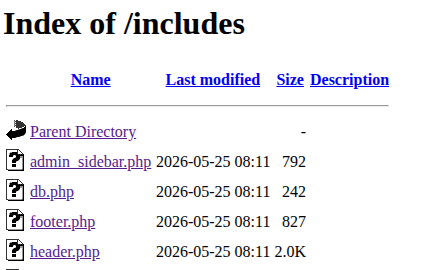
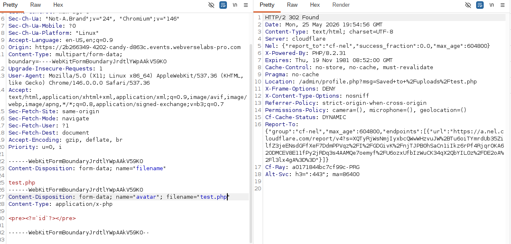
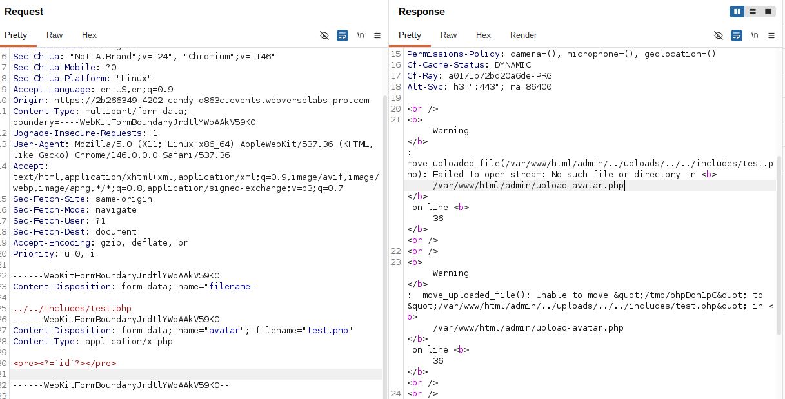
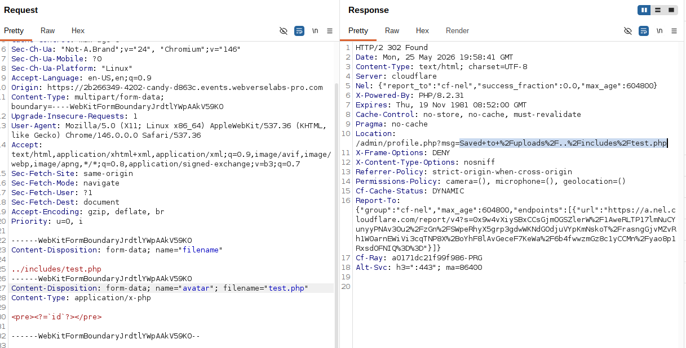
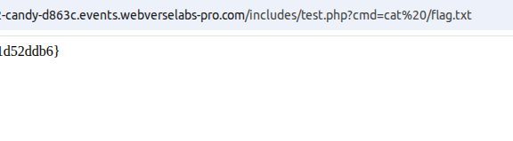

# Candy

### Enumeration

The challenge started with initial reconnaissance of the application. During enumeration I identified a non-functional e-shop together with a contact form.

At first I focused on the contact form and tested several stored XSS payloads, but none of them appeared to execute successfully.


After that I performed directory enumeration using dirsearch and discovered several interesting endpoints:

- /db
- /includes
- /uploads
- /admin/login.php

### Admin panel

The /admin/login.php endpoint was especially interesting because it exposed a staff login form. The same panel was also referenced through a “Staff” link located in the website footer.

Further inspection showed that /db/, /includes/ and /uploads/ had directory listing enabled.

The /db/ directory exposed a downloadable SQLite database file `/db/candy.db`

Dumping the database revealed plaintext administrator credentials:

```sql
CREATE TABLE admins (
id INTEGER PRIMARY KEY AUTOINCREMENT,
username TEXT UNIQUE NOT NULL,
password TEXT NOT NULL
);

INSERT INTO admins VALUES(1,'aurora','uL9HudqdnXsU8SxPPo2Rt7qn');
```

The credentials allowed access to the administrative panel. (The password is different for each lab).

While testing the authentication form, I discovered that the login was also vulnerable to SQL Injection authentication bypass.

Using the following payload as the username:

a' OR 1=1 -- -

together with any password successfully authenticated me into the application.


### File Upload Functionality

Inside the profile section of the admin panel I found an avatar upload feature. The application accepted arbitrary file extensions, including .php files. However, uploaded PHP files inside `/uploads/` were not executed and were instead rendered as plain text by the server.


I also visited the /includes/ directory, where several PHP files such as header.php were accessible due to directory listing being enabled.

Unlike files stored in /uploads/, these PHP files were executed normally by the server, which indicated that the /includes/ directory was part of the application's executable PHP context.



### Discovering Path Traversal

At this point, I started thinking about whether it would be possible to upload a file somewhere other than the default /uploads directory — ideally into /includes, where PHP files were already being executed by the application.

I therefore began analysing the upload functionality in more detail and focused on how the multipart POST request could be manipulated, including whether it was possible to influence the upload path or bypass any server-side restrictions.



I then started experimenting with the name parameter inside the multipart request. Instead of the expected value such as `avatar`, I tried values referencing other directories, for example `includes`, to see whether the backend used this parameter when constructing the upload path. This only resulted in an application error.

Another thing that caught my attention was the structure of the multipart form-data request itself. The upload functionality used both a regular form field named filename, containing a user-controlled value such as test.php, and a separate uploaded file field (avatar) with its own filename attribute.

This made me wonder whether the backend relied on one of these values more than the other when constructing the final upload path or processing uploaded files internally.

I then started modifying the regular filename form field itself. Instead of the original value:

```
------WebKitFormBoundary...
Content-Disposition: form-data; name="filename"

test.php

I replaced it with traversal-style payloads such as:

../../includes/test.php
```
to test whether the backend used this user-controlled value when constructing the final upload path.

Interestingly, this triggered a different and much more informative error response, which revealed several useful details about how the upload functionality handled file paths internally.



From the error message, I was able to better understand how the application constructed the upload path internally. Based on this behaviour, I adjusted the traversal payload and reduced it to a single ../.

After modifying the request accordingly, the file was uploaded successfully outside the intended upload directory. Accessing the uploaded file directly confirmed that the PHP code executed correctly, as the application returned the expected id output from the payload.



### RCE

After confirming that PHP execution was possible, I uploaded a simple web shell payload:

```php
<?php system($_GET['cmd']); ?>
```

This allowed arbitrary command execution via the cmd GET parameter. I then accessed the uploaded file and executed:

`?cmd=cat /flag.txt`

which returned the contents of the flag file and completed the challenge.

