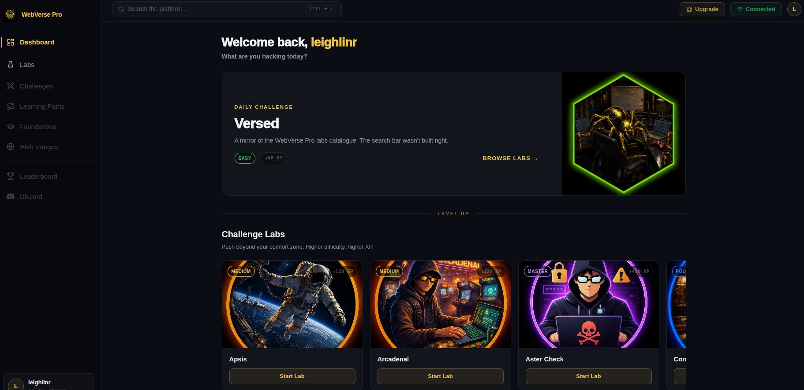
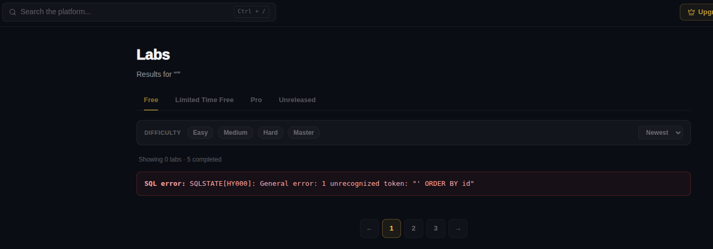
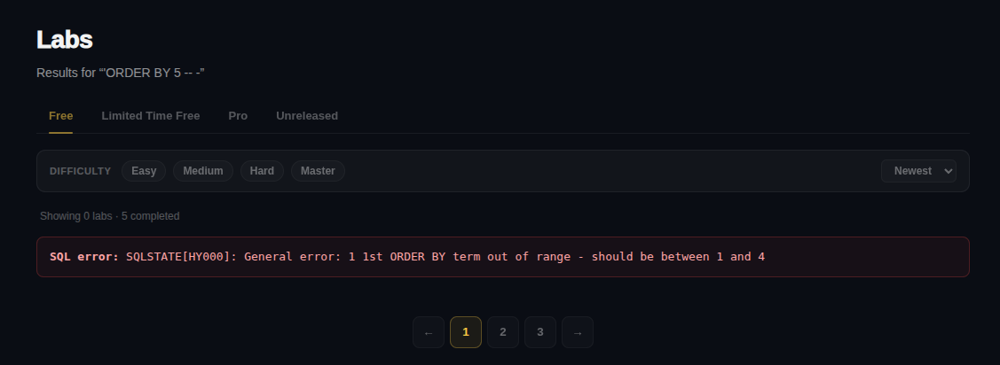
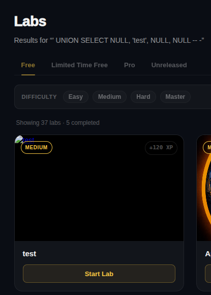
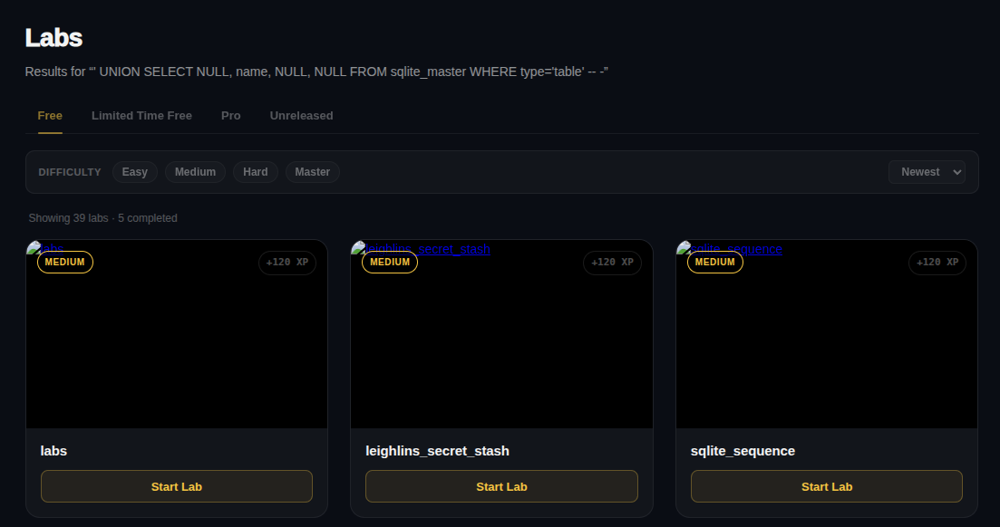
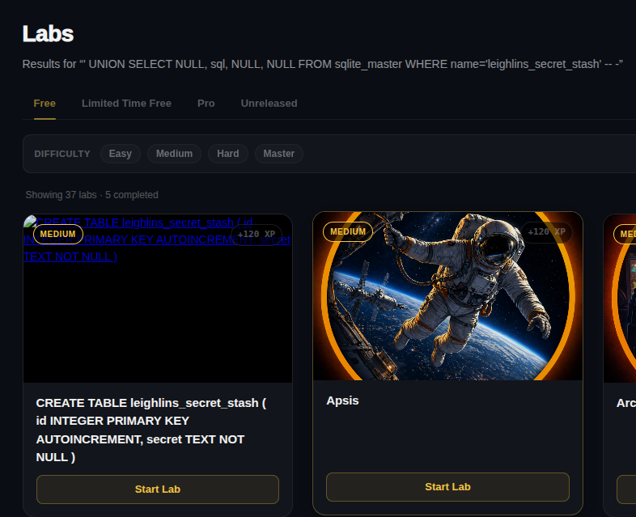
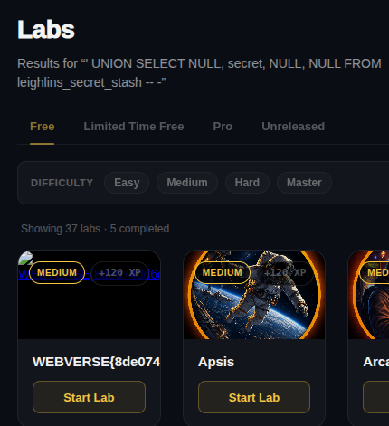

# Versed

Today’s lab looked like a simplified clone of WebVerse with only a few functionalities.

There was only a list of labs where users could choose a specific lab and use a search filter.
Whenever I see a search filter, SQL injection immediately comes to mind.
As usual, I started testing for SQL injection by entering a single apostrophe into the input field.

And it worked this time! The error message revealed that the SQL query was breaking.
At this point it would have been very easy to use sqlmap, but I wanted to take the opportunity to practice manual SQL injection exploitation instead.

I first tried to determine the number of columns by using the ORDER BY technique, starting with: `' ORDER BY 1 -- -`. The application returned an error when I entered: `' ORDER BY 5 -- -`, which indicated that the query contained 4 columns.

Now I could use a UNION SELECT query with 4 columns and try to identify which column accepted string values. I discovered that the second column was suitable for displaying strings using the following payload: `' UNION SELECT NULL, 'test', NULL, NULL -- -`.

At this point, I wanted to enumerate database tables.
Initially, I tried using the information_schema approach commonly used in MySQL, but the resulting error message revealed that the backend was actually using SQLite.
Since SQLite stores schema information inside the sqlite_master table, I used the following payload to enumerate available tables:
`' UNION SELECT NULL, name, NULL, NULL FROM sqlite_master WHERE type='table' -- -`.

The most promising table appeared to be _leighlins_secret_stash_, so I proceeded to determine its column structure: `' UNION SELECT NULL, sql, NULL, NULL FROM sqlite_master WHERE name='leighlins_secret_stash' -- -`.

The final step was to reveal the secret stored inside the table:
`' UNION SELECT NULL, secret, NULL, NULL FROM leighlins_secret_stash -- -`!

